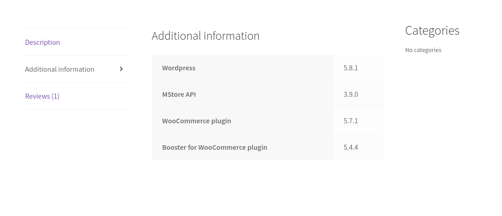

# CTF 03 WordPress Websitte

## Overall Site Information
- **Domain:** http://143.47.40.175:5001/ 
- **WordPress Version:** 5.8.1

The website WordPress Version was found in the website source code.
```bash
  <meta name="generator" content="WordPress 5.8.1">
```

## Plugins Information

- **WooCommerce Version:** 5.7.1
- **Booster for WooCommerce Plugin:** 5.4.4
- **MStore API:** 3.9.0

The website Plugins were found under the file system explorer in the browser debugger and in a website section called More Information.


<div align="center">
<b>Image 1:</b> Additional Info Section
</div>

## Users

- **Admin**
- **orval_sanford**

## Vulnerability

- **CVE-2023-2732**
  - **Description:** The MStore API plugin for WordPress (versions up to and including 3.9.2) is vulnerable to authentication bypass. This vulnerability arises from insufficient verification of the user provided during the add listing REST API request through the plugin. Consequently, unauthenticated attackers can log in as any existing user on the site, including administrators, if they know the user ID.

## Exploit

- The exploit is located in the specified directory.

## Flag

- flag{byebye}


## Run

1. **Create a Virtual Environment:**
    ```bash
    python -m venv myenv
    ```
  
2. **Activate the Virtual Env**
    ```bash
    source myenv/bin/activate
    ```

3. **Install Requirements**
    ```bash
    pip install -r requirements.txt
    ```
4. **Run the Exploit**
    ```bash 
      python3 exploit.py -u [url]
    ```
